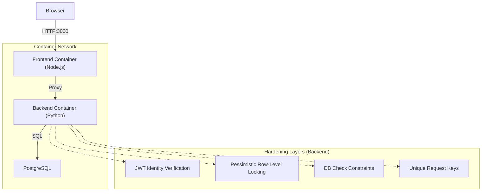
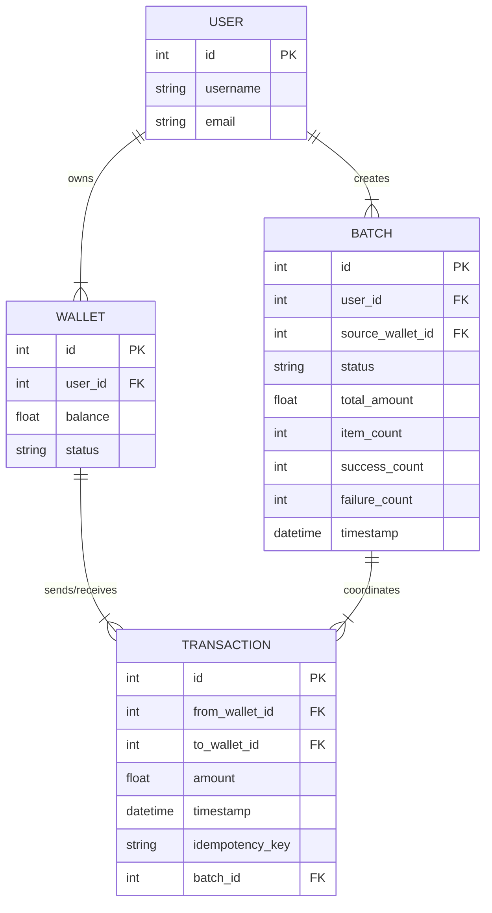

# G-Wallet System Architecture & Reliability Guide

This document provides a comprehensive technical overview of the G-Wallet engine, mapping its journey from a vulnerable prototype to a production-hardened transaction system.

---

## 1. Core Terminology Consistency

> [!NOTE]
> In the context of G-Wallet, the term **"Transaction"** refers specifically to a **ledger record** representing a single, atomic wallet-to-wallet transfer. It should not be confused with a "Database Transaction," which is the underlying persistence mechanism.

---

## 2. System Architecture & Flow

The Wallet Engine is a monolith REST API designed for high-concurrency financial operations.

### Flow Sequence:
1.  **Request Entry**: A user interacts with the **Browser**, which makes an HTTP request to `localhost:3000`.
2.  **Frontend Serving**: The **Frontend Container** (Node.js) serves the static SPA assets and intercepts API calls.
3.  **API Proxying**: Requests targeting `/users`, `/wallets`, etc., are proxied to the **Backend Container** via the internal Docker network (`http://backend:4000`).
4.  **Identity Verification**: The Backend extracts the JWT from the `Authorization` header. Identity is **strictly inferred** from the cryptographically signed token to prevent sender impersonation.
5.  **Secure CRUD Execution**:
    - **Transaction Scope**: A single database transaction is opened.
    - **Lock Ordering**: Involved wallet rows are selected and locked (`FOR UPDATE`) in deterministic order (ascending ID) to prevent circular wait deadlocks.
    - **Balance Validation**: The engine checks if the locked sender row has sufficient funds.
6.  **Atomic Persistence**: Balance changes are updated and the transaction (ledger record) is written. The database transaction is committed, ensuring all changes are permanent or none are.

---

## 3. Database Schema

The G-Wallet uses a relational schema designed for strict consistency and auditability.

### Table Definitions:
-   **Users**: Stores identity information.
-   **Wallets**: The source of truth for balances. Includes a database-level `CheckConstraint` (`balance >= 0`).
-   **Transactions**: The immutable ledger. Every transfer creates a record here. The `idempotency_key` ensures a unique entry per request.
-   **Batches**: Orchestration metadata for mass payouts. Links multiple transactions together but provides no atomicity guarantees across them.

---

## 4. Financial Integrity & Data Representation

### Money Representation
-   **Current Implementation**: Uses `Float` for rapid prototyping and implementation simplicity (compatible with standard JSON serialization).
-   **Production Standard**: In a production environment, all monetary values must use **fixed-precision types** (e.g., `NUMERIC(18,2)`) to avoid the precision loss inherent in floating-point arithmetic.

### Database Isolation & Concurrency
-   **Isolation Level**: The system operates on the **Read Committed** isolation level.
-   **Locking Strategy**: To prevent high-concurrency anomalies (like double-spending), we employ **Pessimistic Row-Level Locking**. By using `SELECT ... FOR UPDATE`, we ensure that:
    -   **Read Skew** is eliminated during the transfer scope.
    -   **Write Conflicts** are handled by serializing access to the specific wallet rows involved in a transfer.

---

## 5. The Hardening Journey (Failure vs. Fix)

| Vulnerability | Build Phase (Fragile) | Rebuild Phase (Hardened) | Technical Implementation |
| :--- | :--- | :--- | :--- |
| **Double Spend** | Concurrent debits exceed balance. | Prevented via Row-Level Locking. | `SELECT ... FOR UPDATE` |
| **Deadlocks** | Circular wait during concurrent locks. | Deterministic Lock Ordering. | Lock Min(ID) then Max(ID) |
| **Partial Commit** | Money lost on middle-step failure. | Atomic DB Transactions. | Unit of Work (commit/rollback) |
| **Replay Attack** | Same request executed twice. | Unique Idempotency Keys. | DB Unique Constraint |
| **Read Skew** | Inconsistent reporting snapshots. | Atomic Bulk Reads / Locking. | Unified Query Patterns |

---

## 6. Hardened Batch Coordination (Orchestration)

The **Batch Payouts Layer** has been hardened into a robust orchestration engine that prioritizes observability and recovery over simple automation.

### 🔄 The Hardened State Machine
- **State Transitions**: `PENDING` → `PROCESSING` → `COMPLETED` | `PARTIALLY_FAILED`.
- **Row Tracking**: Every item in a CSV is persisted as a `BatchRow`, linking it to its specific `idempotency_key` and final `transaction_id`.
- **Idempotency**: All operations are guarded by client-side keys.
- **PIN Authorization**: Mandatory 4-digit numeric PIN for sensitive actions (Transfers, Batch Execution, Compensation).

## 7. Core Principles

### ⚡ Resumability & Recovery
In real-world systems, server crashes during long-running batches are inevitable. G-Wallet handles this via **Index-Based Resumability**:
1.  The engine tracks the `last_processed_index`.
2.  If restarted, the execution logic skips all rows up to that index.
3.  Deterministic idempotency keys (`batch_{id}_row_{index}`) ensure that even if the index is off by one, the ledger remains safe from duplicate debits.

### 🛡️ Compensation vs. Rollback
As per financial design best practices, we use **Compensating Transactions** instead of database rollbacks for batches:
- **No Global Rollback**: Since individual payouts are committed immediately for liquidity, a batch failure does not "un-pay" successful recipients.
- **Manual/API Reversals**: Users can trigger the `/compensate` endpoint to generate reversal transfers (Recipient → Source) for specific rows, maintaining a perfect audit trail of corrections.

---

## 7. Transaction-Level PIN Authorization

G-Wallet distinguishes between **Authentication** (who you are) and **Authorization** (approving an action).

### 🔑 Security Design
- **PIN Ownership**: Each user sets a 4-digit numeric PIN.
- **Hashing**: PINs are never stored in plain text. They are hashed using `PBKDF2-SHA256` before being persisted to the `users` table.
- **Requirement**: A valid PIN is REQUIRED for:
  - Wallet-to-Wallet Transfers
  - Batch Execution
  - Automated Compensation (Reversals)
- **Compromised Token Protection**: Even if a JWT is stolen, the attacker cannot drain funds without the second factor (PIN).

### ⚙️ Enforcement Flow
1. API receives request + JWT + PIN.
2. Backend verifies JWT (Who is the user?).
3. Backend fetches `transaction_pin_hash` for that user.
4. Backend verifies provided PIN against the hash.
5. If valid, the financial logic proceeds. If invalid, the request is rejected *before* any database locks or balance checks occur.

---

## 8. Known Limitations (By Design)

To maintain core correctness and simplicity, the following features are intentionally **Unsupported**:
-   **One-to-Many Atomic Transactions**: Transfers are strictly 1:1.
-   **Batch-Level Atomicity**: Batches are processed sequentially; we do not support "all-or-nothing" for mass payouts across different source/destination sets.
-   **Distributed Transactions**: The system is designed for a single consistent database.
-   **Automatic Compensation**: Compensation logic is external to the core engine.

---

## 8. Real-World Alignment Statement

The G-Wallet architecture is modeled after the **Ledger-first systems** used in modern banking, payment gateways, and payroll platforms. By prioritizing row-level consistency and explicit transfer records (Ledgers) over complex application-side state management, it mirrors the robustness required for actual financial processing where every cent must be accounted for and immutable once settled.

---
*Refined for Build2Break Evaluation*
