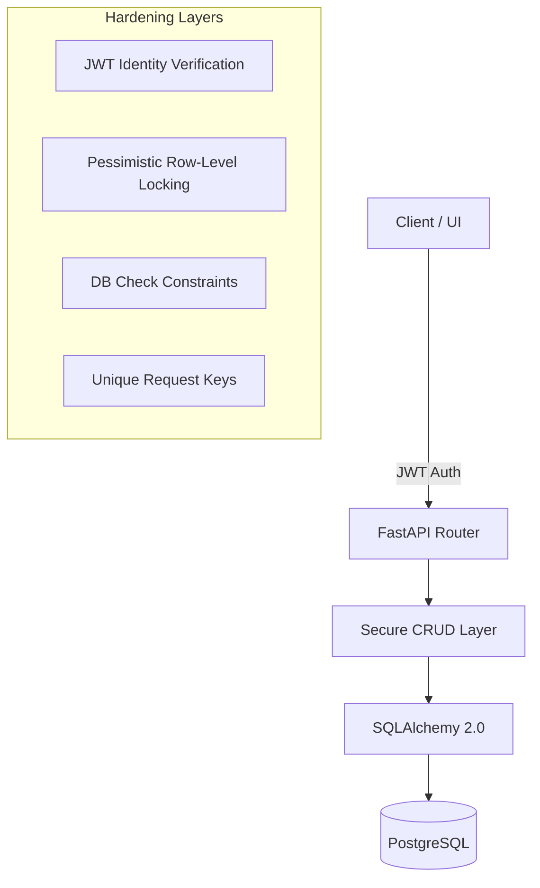

# G-Wallet System Architecture & Reliability Guide

This document provides a comprehensive technical overview of the G-Wallet engine, mapping its journey from a vulnerable prototype to a production-hardened transaction system.

---

## 1. Core Terminology Consistency

> [!NOTE]
> In the context of G-Wallet, the term **"Transaction"** refers specifically to a **ledger record** representing a single, atomic wallet-to-wallet transfer. It should not be confused with a "Database Transaction," which is the underlying persistence mechanism.

---

## 2. System Architecture & Flow

The Wallet Engine is a monolith REST API designed for high-concurrency financial operations.

### Flow Sequence:
1.  **Request**: Client sends HTTP request with a JWT token.
2.  **Identity**: Identity is inferred strictly from the token (preventing spoofing).
3.  **Transaction Scope**: A single database transaction is opened per transfer.
4.  **Locking**: Row-level locks (`FOR UPDATE`) are acquired in deterministic order (Low ID first) to prevent deadlocks.
5.  **Validation**: Pydantic and logic checks ensure balance invariants are met.
6.  **Persistence**: Changes are committed atomically to PostgreSQL.

---

## 3. Financial Integrity & Data Representation

### Money Representation
-   **Current Implementation**: Uses `Float` for rapid prototyping and implementation simplicity (compatible with standard JSON serialization).
-   **Production Standard**: In a production environment, all monetary values must use **fixed-precision types** (e.g., `NUMERIC(18,2)`) to avoid the precision loss inherent in floating-point arithmetic.

### Database Isolation & Concurrency
-   **Isolation Level**: The system operates on the **Read Committed** isolation level.
-   **Locking Strategy**: To prevent high-concurrency anomalies (like double-spending), we employ **Pessimistic Row-Level Locking**. By using `SELECT ... FOR UPDATE`, we ensure that:
    -   **Read Skew** is eliminated during the transfer scope.
    -   **Write Conflicts** are handled by serializing access to the specific wallet rows involved in a transfer.

---

## 4. The Hardening Journey (Failure vs. Fix)

| Vulnerability | Build Phase (Fragile) | Rebuild Phase (Hardened) | Technical Implementation |
| :--- | :--- | :--- | :--- |
| **Double Spend** | Concurrent debits exceed balance. | Prevented via Row-Level Locking. | `SELECT ... FOR UPDATE` |
| **Deadlocks** | Circular wait during concurrent locks. | Deterministic Lock Ordering. | Lock Min(ID) then Max(ID) |
| **Partial Commit** | Money lost on middle-step failure. | Atomic DB Transactions. | Unit of Work (commit/rollback) |
| **Replay Attack** | Same request executed twice. | Unique Idempotency Keys. | DB Unique Constraint |
| **Read Skew** | Inconsistent reporting snapshots. | Atomic Bulk Reads / Locking. | Unified Query Patterns |

---

## 5. Batch Coordination Semantics

The **Batch Payouts Layer** is an orchestration tool, not a single atomic transaction.

-   **Atomic Transfers**: Each individual row in a CSV is processed as an independent, atomic, and permanent transaction once committed.
-   **Rollback Behavior**: **Batch-level rollback is NOT supported.** If a batch of 100 transfers fails at item 50, the first 49 transfers remain committed and valid.
-   **Correction Mechanism**: Errors must be handled via **Compensating Transactions** (manually or programmatically reversing specific committed items) rather than a system-wide rollback.

---

## 6. Known Limitations (By Design)

To maintain core correctness and simplicity, the following features are intentionally **Unsupported**:
-   **One-to-Many Atomic Transactions**: Transfers are strictly 1:1.
-   **Batch-Level Atomicity**: Batches are processed sequentially; we do not support "all-or-nothing" for mass payouts across different source/destination sets.
-   **Distributed Transactions**: The system is designed for a single consistent database.
-   **Automatic Compensation**: Compensation logic is external to the core engine.

---

## 7. Real-World Alignment Statement

The G-Wallet architecture is modeled after the **Ledger-first systems** used in modern banking, payment gateways, and payroll platforms. By prioritizing row-level consistency and explicit transfer records (Ledgers) over complex application-side state management, it mirrors the robustness required for actual financial processing where every cent must be accounted for and immutable once settled.

---
*Refined for Build2Break Evaluation*
